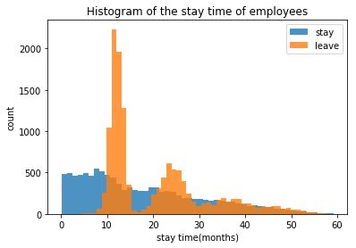
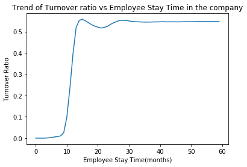

# RevolvingDoor
## Predict employer turnover

## Goal
Employee turnover refers to the number or percentage of the employees who leave the company and replaced by new employees.  Employee turnover has been rampant in the company. The CFO estimates that the cost of replacing an employee is often larger than 100K USD, taking into account the time spent to interview and find a replacement, placement fees, sign-on bonuses and the loss of productivity for several months.

Our goal is to predict employee retention and understand its main drivers.

## Content of this repository
1. RevolvingDoor.ipynb is the Jupyter notebook containing the descriptive and predictive analysis and modeling. 
- Data Wragling and Cleaning
- Feature Engineering
- Exploratory Data Analysis
- Building the prediction model
- Result Analysis
- Conclusion

2. employee_retention.txt
The data containing employee data from a few companies.

## Results
The Gradiant Boosting Model has the best prediction accuracy (0.785). The time that the employee stayed in the company is the most important factor of turnover prediction.  As illustrated in the following figure, when the stay time is around 13 months and 22 months, there are two peaks of employee turnover number. 

If we look at the turnover ratio over staying time, around 13 months, the turnover rate begin to increase a lot. .  

The company need to action to keep these employee. For example, we could do survey when employees reach their one-year and two years anniversary to know what are their concerns and expectation of the company. 

## Future Plan
To know more about the reason of turn over, we'd better collect more data like whether and when employees get a promotion in the company, when and how much the salary increase or even their rating of performance over time. These data would give us more insight on the reason of turnover and take action to decrease turnover. 
